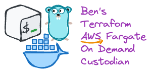

<br/> <!-- markdownlint-disable-line first-line-heading -->

<p align="center">
  <a href="https://github.com/bendoerr-terraform-modules/terraform-aws-fargate-on-demand">
    <picture>
      <source media="(prefers-color-scheme: dark)" srcset="docs/logo-dark.png">
      
    </picture>
  </a>

  <h3 align="center">Ben's Terraform AWS Fargate on Demand Module</h3>

  <p align="center">
    This is how I do it.
    <br/>
    <br/>
    <a href="https://github.com/bendoerr-terraform-modules/terraform-aws-fargate-on-demand">
      <strong>Explore the docs »</strong>
    </a>
    <br/>
    <br/>
    <a href="https://github.com/bendoerr-terraform-modules/terraform-aws-fargate-on-demand/issues">
      Report Bug
    </a>
    .
    <a href="https://github.com/bendoerr-terraform-modules/terraform-aws-fargate-on-demand/issues">
      Request Feature
    </a>
  </p>
</p>


## About The Project

TODO

## Usage

```terraform
TODO
}
```

## Requirements

TODO

## Providers

TODO

## Modules

TODO

## Resources

TODO

## Inputs

TODO

## Outputs

TODO

## Roadmap

See the
[open issues](https://github.com/bendoerr-terraform-modules/terraform-aws-fargate-on-demand/issues)
for a list of proposed features (and known issues).

## Contributing

Contributions are what make the open source community such an amazing place to
learn, inspire, and create. Any contributions you make are **greatly
appreciated**.

- If you have suggestions for adding or removing projects, feel free to
  [open an issue](https://github.com/bendoerr-terraform-modules/terraform-aws-fargate-on-demand/issues/new)
  to discuss it, or directly create a pull request after you edit the
  _README.md_ file with necessary changes.
- Please make sure you check your spelling and grammar.
- Create individual PR for each suggestion.

### Creating A Pull Request

1. Fork the Project
2. Create your Feature Branch (`git checkout -b feature/AmazingFeature`)
3. Commit your Changes (`git commit -m 'Add some AmazingFeature'`)
4. Push to the Branch (`git push origin feature/AmazingFeature`)
5. Open a Pull Request

## License

Distributed under the MIT License. See
[LICENSE](https://github.com/bendoerr-terraform-modules/terraform-aws-fargate-on-demand/blob/main/LICENSE.txt)
for more information.

## Authors

- **Benjamin R. Doerr** - _Terraformer_ -
  [Benjamin R. Doerr](https://github.com/bendoerr/) - _Built Ben's Terraform
  Modules_

## Acknowledgements

- [Ray 'doctorray117' Gibson (minecraft-ondemand)](https://github.com/doctorray117/minecraft-ondemand)
  provided the original inspiration and approach for this module.
- [ShaanCoding (ReadME Generator)](https://github.com/ShaanCoding/ReadME-Generator)
